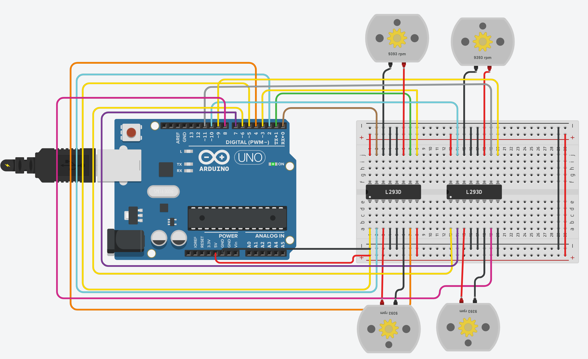

# Arduino 4 DC Motors Control using L293D

## 📌 Description
This project demonstrates how to control four DC motors using an Arduino Uno and two L293D motor driver ICs. The robot performs a predefined movement sequence automatically.

## 🚀 Movement Sequence
- ▶️ Move Forward for 30 seconds
- ◀️ Move Backward for 1 minute
- ↔️ Turn Right and Left alternately for 1 minute

## 🛠️ Components Used
- Arduino Uno
- 2 × L293D Motor Driver IC
- 4 × DC Motors
- Breadboard
- Jumper Wires
- USB Cable

## 📂 Files
- `Motor_Control.ino` – Arduino source code

## 🖼️ Circuit Diagram

```md

```
## 🔗 Tinkercad Project
https://www.tinkercad.com/things/7KZRTqyj7vY-motorcontrol?sharecode=mjZ7lCPuXAobLNcE14nF1pEEGjVPeaRpgiMsA48tojs

## 📖 How It Works
1. Initializes all motor control pins.
2. Drives all four motors forward for 30 seconds.
3. Reverses all four motors for 1 minute.
4. Alternates between right and left turns every 5 seconds for 1 minute.
5. Repeats the sequence continuously.

## ✨ Features
- Four DC motor control
- Forward and backward movement
- Right and left turning
- Simple Arduino implementation
